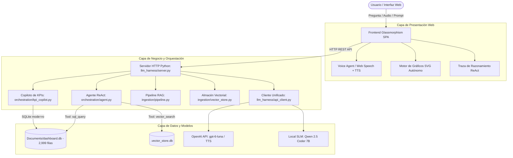

# 🤖 Documentación Técnica del Desarrollo del Agente (AI Tooling Platform)

> **Repositorio:** `abnerlugo1/ai-tooling`  
> **Rama de Desarrollo:** `DEV_Agent`  
> **Entorno de Despliegue:** Docker Container (`ai-tooling-app`) en `http://localhost:8080/`  
> **Motor de Inferencia:** OpenAI (`gpt-6-luna`), Anthropic Claude 3.5 Sonnet / AWS Bedrock, Qwen 2.5 Coder 7B GGUF (In-Process)  
> **Almacenamiento de Datos:** SQLite (`Documents/dashboard.db` y `.vector_store.db`)

---

## 1. Visión General del Proyecto

Esta plataforma agéntica fue desarrollada para resolver de forma unificada tres grandes desafíos en la ingeniería de Inteligencia Artificial aplicada:
1. **Benchmark Comparativo de Arquitecturas LLM**: Comparación empírica en tiempo real de latencia, TTFT (Time-to-First-Token), throughput, costo monetario por token y consumo de memoria entre **modelos basados en API en la nube** y **modelos integrados en el proceso (in-process / on-device)**.
2. **Exploración de Espacios Vectoriales & RAG Híbrido**: Generación e inspección geométrica de embeddings densos (384 dimensiones) y búsqueda semántica híbrida (BM25 + similitud coseno) sobre la base vectorial de conocimiento.
3. **Agente Orquestador Autónomo & Copiloto de KPIs (dashboard.db)**:
   - Razonamiento multi-herramienta con ciclo **ReAct** (*Reasoning + Acting*).
   - Generación segura de consultas Text-to-SQL sobre 2,999 registros operacionales.
   - Copiloto multimodal con interacción de voz en tiempo real (*Voice Agent*).
   - **Renderizado automático de gráficos visuales interactivos** integrados directamente en las respuestas del agente.

---

## 2. Arquitectura del Agente y Módulos Principales



---

## 3. Componentes Detallados

### 3.1. Agente Orquestador Autónomo ReAct (`orchestration/agent.py`)
Implementa el patrón formal de razonamiento y acción:
- **Thought**: El agente evalúa la solicitud del usuario, identifica qué información le falta y planifica el siguiente paso.
- **Action**: Invoca una de las herramientas del registro (`ToolRegistry`) enviando argumentos estructurados en JSON.
- **Observation**: Recibe los resultados reales de la ejecución (por ejemplo, filas de SQLite o fragmentos vectoriales).
- **Final Answer**: Sintetiza una conclusión fundamentada en los datos recopilados, citando métricas y evidencias concretas.

#### Registro de Herramientas (`orchestration/tools.py`):
- `sql_query`: Ejecución de consultas analíticas sobre `Documents/dashboard.db` (filas acotadas a 50 registros por llamada para protección de contexto).
- `inspect_schema`: Lectura de tablas, columnas y tipos de datos para guiar la formulación de consultas SQL sin alucinaciones.
- `vector_search`: Búsqueda híbrida (léxica + semántica) para recuperar contextos no estructurados.
- `ingest_knowledge`: Ingesta dinámica de documentos en el almacén vectorial.

---

### 3.2. Copiloto Especializado en KPIs de Negocio (`orchestration/kpi_copilot.py`)
Diseñado con guardrails específicos para interactuar exclusivamente sobre la base de datos `Documents/dashboard.db`:
- **Guardrail de Dominio**: Si el usuario formula preguntas fuera de contexto (ej. clima, política, programación general), el copiloto detecta el desvío y redirige al usuario amablemente hacia el análisis de métricas operacionales.
- **Generación Text-to-SQL Segura**: Transforma preguntas en lenguaje natural a consultas SQL SQLite optimizadas (conteo, promedios, filtros y agrupaciones).
- **Extracción de Métricas**:
  - Total de registros: 2,999 clientes sincronizados.
  - Distribución por categorías (Asistencia vial, Membresía dental, Check up, etc.).
  - Demografía: distribución por género (59% Mujeres, 41% Hombres) y edad promedio (40.2 años).
  - Ranking de servicios específicos (Grúa, Check up médico, Limpieza dental, etc.).

---

### 3.3. Agente de Voz Multimodal (`Voice Agent`)
Permite dialogar bidireccionalmente con el sistema:
- **Entrada de Voz (Speech-to-Text)**: Utiliza la API de reconocimiento continuo `webkitSpeechRecognition` / `SpeechRecognition` del navegador con soporte nativo para idioma español.
- **Transcripción en Vivo**: Muestra una burbuja flotante con la frase reconocida en tiempo real.
- **Salida de Voz (Text-to-Speech)**: Endpoint `/api/kpi/voice-tts` integrado con los modelos de voz de alta fidelidad de OpenAI (`alloy`, `nova`, `shimmer`), con fallback automático a la síntesis de voz offline del navegador (`window.speechSynthesis`).
- **Feedback Visual**: Ecualizador animado reactivo (*Waveform Equalizer*) y botón dinámico con animación de pulso mientras el usuario habla o el agente responde.

---

### 3.4. Motor de Gráficos Dinámicos en la Respuesta del Agente (`renderAgentResponseChart`)
Ubicado en `llm_harness/web/app.js`, este motor renderiza visualizaciones directamente dentro de la tarjeta de respuesta sin utilizar librerías externas o CDNs:
- **Detección Heurística de Columnas (`detectColumns`)**:
  - Identifica métricas cuantitativas (`total`, `cantidad`, `solicitudes`, `count`, `promedio`, `edad_promedio`, `porcentaje`).
  - Identifica campos cualitativos y temporales (`servicio`, `categoria`, `genero`, `mes`, `fecha`, `cliente`).
- **Renderizado Adaptativo**:
  - 📊 **Barras Horizontales con Gradiente**: Muestra rankings ordenados con insignias (`#1`, `#2`...), etiquetas, valores formateados, cálculo porcentual y barras con animación de llenado (`cubic-bezier`).
  - 🍩 **Gráfico Donut SVG**: Proyecciones demográficas de dos segmentos (ej. Femenino vs Masculino) con circunferencias en SVG de precisión y desglose numérico en leyenda.
  - 📈 **Gráfico de Columnas Cronológicas (Timeline)**: Series de tiempo automáticas para agrupaciones por mes o fecha.
  - 💎 **Métrica Escalar**: Tarjetas de impacto visual cuando se consulta un valor único (ej. conteos globales).

---

## 4. Auditoría y Hardening de Seguridad Implementado

Se ejecutó una revisión de seguridad integral mitigando vulnerabilidades críticas:

| Control | Riesgo Mitigado | Implementación Técnica |
| :--- | :--- | :--- |
| **SEC-01** | Fuga de Credenciales | Exclusión de `.env` en [`.gitignore`](file:///c:/Users/abner/.gemini/antigravity-ide/scratch/ai-tooling/.gitignore) y creación de plantilla segura [`.env.example`](file:///c:/Users/abner/.gemini/antigravity-ide/scratch/ai-tooling/.env.example). |
| **SEC-02** | Inyección SQL y Modificación de Base de Datos | Apertura de SQLite obligatoria con `mode=ro` (`file:...dashboard.db?mode=ro`). Bloqueo de sentencias múltiples (`;`), validación estricta de inicio (`SELECT`, `WITH`) y lista negra de palabras reservadas DDL/DML (`DROP`, `DELETE`, `ATTACH`, `ALTER`, `INSERT`). |
| **SEC-03** | Cross-Site Scripting (DOM-XSS) | Función de escape HTML [sanitize / escapeHtml](file:///c:/Users/abner/.gemini/antigravity-ide/scratch/ai-tooling/llm_harness/web/app.js#L2-L12) aplicada a encabezados, celdas de tablas, gráficos y tooltips. |
| **SEC-04** | Ataques de Denegación de Servicio (DoS / Flooding) | Rate Limiting en memoria tipo *Sliding Window* configurado en 120 peticiones por minuto por IP en [`llm_harness/server.py`](file:///c:/Users/abner/.gemini/antigravity-ide/scratch/ai-tooling/llm_harness/server.py). Límite de tamaño de payload a 2 MB (`MAX_PAYLOAD_BYTES`). |
| **SEC-05** | Cabeceras de Seguridad HTTP | Inyección de `X-Content-Type-Options: nosniff`, `X-Frame-Options: SAMEORIGIN` y `X-XSS-Protection: 1; mode=block`. |
| **SEC-06** | Control de Acceso y Autenticación | Soporte para HTTP Basic Authentication (`CHATBOT_AUTH_ENABLED`, `CHATBOT_AUTH_USER`, `CHATBOT_AUTH_PASS`). |

---

## 5. Pruebas Unitarias y Validación

El proyecto cuenta con una suite completa de pruebas unitarias en `tests/`:
- `test_orchestration.py`: Validación del ciclo ReAct, despacho de herramientas y manejo de trazas.
- `test_kpi_copilot.py`: Validación de guardrails de dominio, validación sintáctica de SQL y consultas analíticas.
- `test_dashboard_db.py`: Prueba de seguridad de lectura exclusiva (`test_read_only_safety`) garantizando que intentos de escritura como `INSERT` o `UPDATE` sean bloqueados tanto a nivel de conexión URI como a nivel lógico.
- `test_ingestion.py` y `test_vector_store.py`: Pruebas de fragmentación de texto, generación de vectores y métricas de similitud coseno.

**Resultado de ejecución:**
```bash
python -m unittest discover tests
.........................
Ran 25 tests in 10.894s
OK
```

---

## 6. Guía de Ejecución y Despliegue

### 6.1. Ejecución con Docker (Recomendado)
El proyecto cuenta con un contenedor Docker totalmente aprovisionado:
```bash
# Construir imagen
docker build -t ai-tooling:latest .

# Ejecutar contenedor exponiendo el puerto 8080
docker run -d --name ai-tooling-app -p 8080:8080 --env-file .env ai-tooling:latest

# Comprobar salud del servicio
curl http://localhost:8080/api/stats
```

### 6.2. Ejecución Local (Python)
```bash
# Instalar dependencias
pip install -r requirements.txt

# Iniciar servidor web
python -m llm_harness.server
```
La interfaz estará accesible en `http://localhost:8080/`.

---

## 7. Registro de Cambios y Commits Relevantes

- `4e7d185`: *Hardening de seguridad integral (SEC-01 a SEC-06): SQLite mode=ro, rate limiting, mitigación XSS y headers defensivos.*
- `0df4c7d`: *Implementación del motor de gráficos dinámicos interactivos en la respuesta del agente (barras horizontales con gradientes, donut demográfico y series temporales).*
- **Rama:** `DEV_Agent` integrada y sincronizada con el repositorio remoto.
