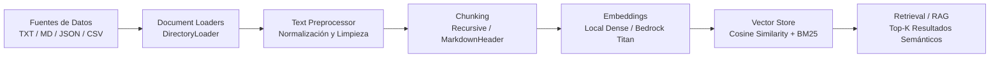

# Pipeline de Ingesta y Procesamiento de Datos (RAG & AI Tooling)

Pipeline modular, de alto rendimiento y extensible para la carga, preprocesamiento, chunking inteligente, generación de embeddings y búsqueda vectorial (semántica e híbrida) para sistemas RAG y agentes de IA.

---

## 🏗 Arquitectura del Pipeline



---

## 🚀 Componentes Principales

1. **Document Loaders (`ingestion/loader.py`)**:
   - `TextLoader`: Lectura de archivos de texto plano con soporte de encoding.
   - `MarkdownLoader`: Soporte para documentos Markdown con extracción de metadatos YAML frontmatter.
   - `JSONLoader`: Ingesta de registros JSON estructurados y JSONL.
   - `CSVLoader`: Parseo de filas tabulares a representaciones documentales estructuradas.
   - `DirectoryLoader`: Escaneo recursivo por extensiones con descarte de patrones ignorados (`.git`, `__pycache__`, etc.).

2. **Text Preprocessor (`ingestion/preprocessor.py`)**:
   - Normalización canónica Unicode (NFKC).
   - Eliminación de caracteres de control preservando saltos de línea y tabuladores.
   - Normalización de saltos de línea CRLF / LF y consolidación de espacios consecutivos.

3. **Estrategias de Chunking (`ingestion/chunker.py`)**:
   - `RecursiveCharacterChunker`: División jerárquica respetando `chunk_size` y `chunk_overlap`.
   - `MarkdownHeaderChunker`: División estructurada por encabezados (`#`, `##`, `###`), preservando la jerarquía como contexto en los metadatos.
   - `estimate_tokens`: Estimación calibrada de tokens para control de ventanas de contexto en LLMs.

4. **Embeddings & Vector Store (`ingestion/embeddings.py`, `ingestion/vector_store.py`)**:
   - `LocalDenseEmbedder`: Vectorizador denso determinista L2-normalizado sin dependencias externas pesadas.
   - `BedrockTitanEmbedder`: Conector para embeddings de Amazon Bedrock (`amazon.titan-embed-text-v1/v2`).
   - `BM25Scorer`: Modelo léxico Okapi BM25 para búsqueda híbrida (palabras clave + similitud semántica).
   - `VectorStore`: Almacén vectorial con cálculo de similitud coseno, filtros de metadatos y persistencia en base de datos SQLite.

---

## 💻 Uso desde CLI

### 1. Ingesta de Documentos
```bash
python -m ingestion.cli ingest capstones/ --db .vector_store.db --chunk-size 500 --chunk-overlap 50
```

### 2. Consulta Semántica e Híbrida
```bash
# Búsqueda semántica
python -m ingestion.cli query "Bedrock knowledge bases" --db .vector_store.db --top-k 3

# Búsqueda híbrida (Dense + BM25)
python -m ingestion.cli query "Local LLM llama.cpp deployment" --db .vector_store.db --top-k 3 --hybrid --alpha 0.7
```

### 3. Estadísticas del Vector Store
```bash
python -m ingestion.cli stats --db .vector_store.db
```

---

## 🐍 Uso desde Python

```python
from pathlib import Path
from ingestion import IngestionPipeline, RecursiveCharacterChunker, VectorStore

# 1. Instanciar pipeline con almacenamiento en SQLite
pipeline = IngestionPipeline(
    chunker=RecursiveCharacterChunker(chunk_size=400, chunk_overlap=40),
    db_path=".vector_store.db"
)

# 2. Ingestar y procesar archivo o directorio
report = pipeline.run("capstones/c01-capstone.md")
print(f"Documentos cargados: {report.documents_loaded}")
print(f"Chunks creados: {report.chunks_created}")

# 3. Realizar búsqueda semántica híbrida
results = pipeline.query("AWS Titan embeddings", top_k=3, hybrid=True)
for res in results:
    print(f"Rank {res.rank} [Score: {res.score:.4f}]: {res.chunk.content[:150]}...")
```

---

## 🧪 Pruebas Unitarias

Para ejecutar la suite de pruebas unitarias:

```bash
python -m unittest discover -s tests -p "test_*.py" -v
```
