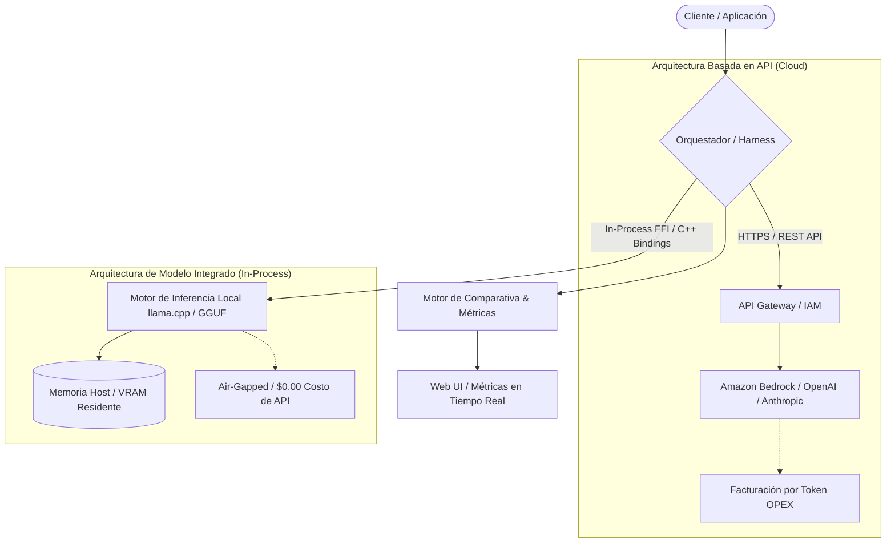

# Aplicación de Prueba: Arquitecturas de LLM basadas en API vs Modelos Integrados

Esta aplicación implementa un arnés de evaluación y benchmarking comparativo entre los dos paradigmas dominantes en la ingeniería de Inteligencia Artificial moderna:

1. **Arquitecturas Basadas en API (Cloud Managed)**: Invocación de Foundation Models masivos (ej. Claude 3.5 Sonnet, GPT-4o, Amazon Titan) a través de interfaces HTTP/REST y SDKs en la nube.
2. **Arquitecturas de Modelos Integrados (In-Process / On-Device)**: Ejecución de modelos en proceso (ej. cuantizaciones GGUF Q4_K_M con llama.cpp, ONNX Runtime o Small Language Models 1B–7B) residiendo directamente en memoria del host.

---

## 🏛 Diagrama de Arquitecturas



---

## 📊 Matriz Comparativa de Ingeniería

| Dimensión | Arquitectura Basada en API | Arquitectura de Modelo Integrado |
| :--- | :--- | :--- |
| **Modelo Financiero** | **OPEX Puro**: Se paga por millón de tokens procesados (Prompt + Completion). | **CAPEX**: Costo amortizado de hardware; **$0.00** costo variable por llamada. |
| **Consumo de Memoria** | **Mínimo**: Cliente ultra-ligero (~12 MB RAM para cliente HTTP). | **Elevado**: Requiere de 2 GB a 16 GB de RAM/VRAM residente según cuantización. |
| **Latencia & Red** | Sujeto a **RTT de red**, colas de espera en la nube y fluctuaciones de ancho de banda. | **Ultra-rápido en TTFT** (Time To First Token); predecible y sin dependencia de internet. |
| **Privacidad & Compliance** | Datos en tránsito hacia infraestructura externa (requiere acuerdos DPA / BAA / HIPAA). | **100% Air-Gapped**: Ningún paquete abandona el proceso; ideal para defensa y banca. |
| **Escalabilidad** | Elástica e infinita gestionada por el proveedor en la nube. | Limitada por la cantidad de hilos de CPU y VRAM disponible en la máquina física. |
| **Capacidad de Razonamiento**| Modelos de frontera de cientos de miles de millones de parámetros. | Acotado a SLMs (Small Language Models de 1B a 14B parámetros). |

---

## 🚀 Cómo Ejecutar la Aplicación

### 1. Interfaz Web Interactiva (Glassmorphism & Tiempo Real)
Inicia el servidor local:
```bash
python -m llm_harness.server
```
Abre en tu navegador:
```
http://127.0.0.1:8080/
```

### 2. Evaluación Rápida vía Línea de Comandos (CLI)
```bash
# Comparativa básica
python -m llm_harness.cli "Explica la diferencia entre arquitecturas de LLM basadas en API y modelos integrados"

# Comparativa con RAG Contextual activado (usando la base vectorial indexada)
python -m llm_harness.cli "¿Cuáles son los entregables del Capstone 1 de AWS Bedrock?" --rag

# Salida en formato JSON estructurado
python -m llm_harness.cli "¿Qué arquitectura ofrece mayor privacidad?" --json
```

---

## 🧪 Pruebas Automatizadas

Para validar todos los componentes arquitectónicos y pruebas del pipeline:
```bash
python -m unittest discover -s tests -p "test_*.py" -v
```
*(12/12 pruebas unitarias aprobadas).*
