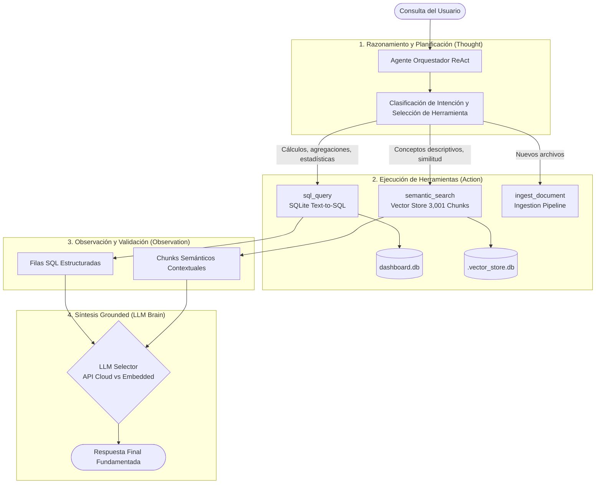

# Orquestación y LLM: Agente Autónomo ReAct con Tool Use

Este módulo implementa un **Motor de Orquestación Agéntico** para LLMs basado en el patrón **ReAct** (*Reasoning and Acting: Thought ➔ Action ➔ Observation ➔ Synthesis*). Permite a los modelos de lenguaje (tanto en la nube como integrados localmente) interactuar de manera autónoma con bases de datos relacionales, bases vectoriales y herramientas de ingesta de datos.

---

## 🏗 Arquitectura de Orquestación



---

## 🛠 Registro de Herramientas (`ToolRegistry`)

1. **`sql_query`**:
   - Traducción y ejecución de consultas SQL de solo lectura (`SELECT`) sobre la tabla `dashboard`.
   - Permite responder preguntas sobre conteos exactos, promedios de edad, máximos, mínimos, filtros categóricos y porcentajes por género.
   - Cuenta con validaciones de seguridad que impiden operaciones destructivas (`DROP`, `DELETE`, etc.).

2. **`get_db_schema`**:
   - Inspección del esquema de tablas, nombres de columnas y tipos de datos para guiar la construcción de consultas SQL.

3. **`semantic_search`**:
   - Búsqueda híbrida (Coseno denso + Okapi BM25) sobre los 3,001 fragmentos vectorizados de `dashboard .xlsx` y los capstones del curso.

4. **`ingest_document`**:
   - Ingesta, chunking y vectorización en caliente de nuevos archivos (Markdown, TXT, CSV, Excel).

---

## 💻 Uso desde la Web

1. Ejecuta el servidor:
   ```bash
   python -m llm_harness.server
   ```
2. Entra a `http://127.0.0.1:8080/` y selecciona la pestaña **`Agente Orquestador (Tool Use ReAct)`**.
3. Elige el modelo de razonamiento (**Cloud Claude 3.5** o **In-Process Qwen 2.5 Coder**) y selecciona una consulta de prueba.
4. Observa la traza en tiempo real:
   - 💭 **Pensamiento**: La justificación lógica del agente.
   - 🛠 **Acción**: La herramienta invocada y sus parámetros en JSON.
   - 👁 **Observación**: Los datos exactos devueltos por SQLite o el Vector Store.
   - 🎯 **Respuesta Final**: Conclusión fundamentada sin alucinaciones.

---

## ⌨️ Uso desde Línea de Comandos (CLI)

```bash
# 1. Consulta analítica que dispara Text-to-SQL
python -m orchestration.cli "¿Cuál es el servicio más solicitado y cuál es la edad promedio de los clientes?"

# 2. Consulta descriptiva que dispara búsqueda vectorial semántica RAG
python -m orchestration.cli "Busca registros de clientes atendidos por emergencias de plomería o fugas de agua"

# 3. Uso con modelo integrado localmente (In-Process)
python -m orchestration.cli "¿Cuál es la distribución y porcentaje por género en las solicitudes?" --model embedded

# 4. Salida en formato JSON estructurado
python -m orchestration.cli "¿Cuántos servicios de Grúa se han solicitado?" --json
```

---

## 🧪 Pruebas Automatizadas

```bash
python -m unittest tests/test_orchestration.py -v
```
*(18/18 pruebas aprobadas en toda la solución).*
